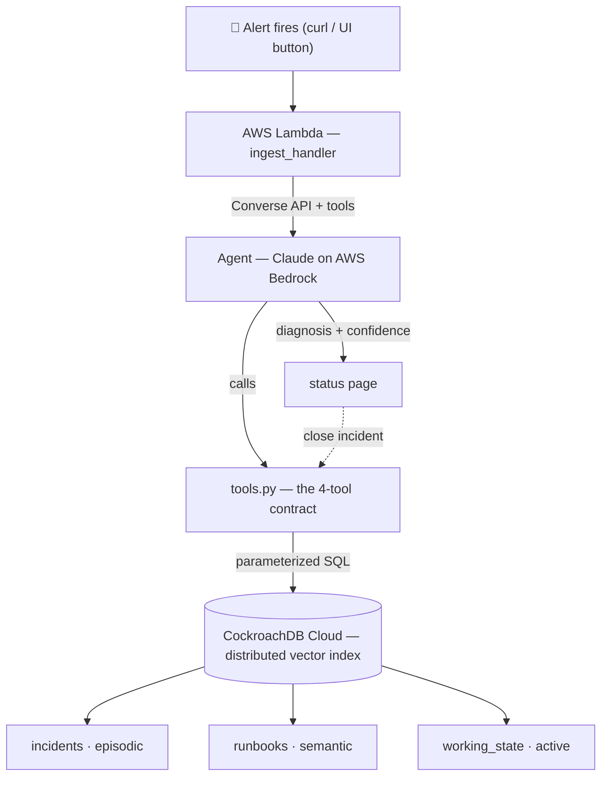

<div align="center">

# Recall

### An on-call agent that remembers every incident your team ever had — <br/>and whose memory survives the very outages it's diagnosing.

[](https://github.com/santapong/ReCall/actions/workflows/ci.yml)
[](pyproject.toml)
[](https://docs.astral.sh/uv/)
[](https://docs.astral.sh/ruff/)
[](LICENSE)
[](docs/01-objective-roadmap.md)

**CockroachDB × AWS hackathon entry** · built solo, in the open · submission **Aug 15, 2026**

[How it works](#how-it-works) ·
[Memory design](#memory-design--three-layers) ·
[Why CockroachDB](#why-cockroachdb) ·
[Quickstart](#quickstart) ·
[Roadmap](#roadmap) ·
[Development](#development)

</div>

---

> **Status — P0, foundation probe.** The design is locked and fully documented in [`docs/`](docs/index.md);
> the [roadmap](#roadmap) below tracks what is real today. No demo URL or video yet — those land at P3–P5.

## The problem

Tribal on-call knowledge lives in senior engineers' heads and rots in unread postmortems. When they
leave, it evaporates — and the next 2 a.m. incident gets diagnosed from zero, again. Recall makes
institutional incident memory **durable, queryable, and agent-native**: every resolved incident makes
the next one faster. And because that memory lives in CockroachDB, it survives the very outages it's
helping diagnose.

## How it works



1. An alert POSTs to a Lambda Function URL; ingest is idempotent (same alert twice = same incident).
2. The agent embeds the alert and searches CockroachDB's **distributed vector index** for the closest
   past incidents at the fictional SaaS "Orbital" — scoped per service, decay-ranked so fresh
   incidents outrank stale ones.
3. It proposes a diagnosis **grounded in a real past resolution**, citing real incident IDs and a real
   runbook step — or, when nothing is close enough, says so plainly instead of guessing.
4. On close, the resolution is scrubbed of names and written back — so the *very next* similar alert
   retrieves it.

**Signature demo:** kill a database node mid-diagnosis, live on camera. The in-flight answer
completes; row counts stay identical; the incident clock never stops.

## Memory design — three layers

| Layer | Table | What it holds | Written by |
|---|---|---|---|
| **Episodic** | `incidents` | Every incident ever, resolved or in-flight, with embeddings | ingest + close path |
| **Semantic** | `runbooks` | Distilled how-to knowledge, independent of any one incident | seed (nightly consolidation as stretch) |
| **Working** | `working_state` | What the agent believes about the *active* incident — retrieved matches, proposed diagnosis, confidence | the agent, via one tool |

Schema: [`infra/schema.sql`](infra/schema.sql). Retrieval is a service-scoped `<->` vector query with a
decay re-rank in Python (`score = (1 − norm_distance) · exp(−age_days / half_life)`), so the ranking
is tunable and unit-testable.

## The agent's contract

The tool manifest is **closed at exactly four tools** — memory read/write only, no raw SQL, no escape
hatches. This isn't a style choice; it's the security and honesty story, and a test fails if anyone
adds a fifth.

| Tool | Does | Guarantee |
|---|---|---|
| `search_incidents` | vector search + decay re-rank | returns an explicit confidence label: `high` / `low` / `none` |
| `get_runbook` | fetch one runbook by ID | read-only, no search |
| `propose_diagnosis` | record the diagnosis | writes *working memory only*; cited IDs are validated against the DB — an unknown ID raises, never persists |
| `write_incident` | close + write back the fix | blameless scrub first: names, @handles, emails never persist |

**Propose-only:** the agent never executes fixes. **Confidence honesty:** at `none` it says "no close
match in memory" and stops — zero invented incident IDs, enforced by tests.

## Why CockroachDB

| The demo needs | CockroachDB delivers |
|---|---|
| Memory that survives infrastructure failure | Distributed, replicated SQL — kill 1 of 3 nodes mid-diagnosis, zero committed rows lost |
| Semantic search over incidents | Native `VECTOR` type + distributed vector index (C-SPANN), scoped per service by a prefix column |
| "What did memory believe at 02:14?" | `AS OF SYSTEM TIME` time-travel reads |
| A boring, auditable data path | Postgres wire protocol — plain parameterized SQL via psycopg 3, no ORM |

## Tech stack

| Layer | Pick | Why |
|---|---|---|
| Agent | Claude on **AWS Bedrock** (Converse API), custom ~50-line loop | full control of the 4-tool manifest; confidence branching stays visible |
| Embeddings | Bedrock Titan | same platform, same credential, no second vendor |
| Ingest | **AWS Lambda** + Function URL | one URL, zero gateway config, fewest moving parts on demo day |
| Database | **CockroachDB Cloud** + distributed vector index | see table above — it *is* the thesis |
| Frontend | one static HTML page, vanilla JS | the audience is a camera; build risk ≈ 0 |
| Tooling | Python 3.12 · uv · psycopg 3 · pydantic · pytest · ruff | boring wins; every pick documented in [`docs/04`](docs/04-tech-stack.md) |

## Quickstart

```bash
git clone https://github.com/santapong/ReCall.git && cd ReCall
uv sync                      # deps — uv provisions Python 3.12 itself
uv run pytest                # fast suite: structural + unit tests, all green
make help                    # every workflow: probe, migrate, seed, deploy…
```

With a CockroachDB cluster (free tier works — `cp .env.example .env` and fill it in):

```bash
make probe                   # P0: DDL + 5 rows + one `<->` vector query, then cleans up
make migrate                 # apply infra/migrations/*.sql in order
```

## Roadmap

Gate-exited phases, dates fixed — full detail and 13 acceptance criteria in
[`docs/01-objective-roadmap.md`](docs/01-objective-roadmap.md).

| Phase | Window | Exit criterion | |
|---|---|---|---|
| **P0 · Probe** | → Jul 8 | live cluster + vector query + Bedrock access requested | 🟡 in progress |
| **P1 · Memory foundation** | Jul 8–12 | planted incident retrieved top-3 from CLI; ~80-postmortem corpus | ⚪ |
| **P2 · Agent loop** | Jul 13–26 | `curl` an alert → diagnosis citing a real incident + runbook | ⚪ |
| **P3 · Surface** | Jul 27–Aug 2 | live status page; demo script ≤3 min | ⚪ |
| **P4 · Resilience** | Aug 3–9 | node-kill rehearsal recorded, zero row loss verified | ⚪ |
| **P5 · Ship** | Aug 10–15 | video ≤3:00 up; Devpost submission confirmed | ⚪ |

## Development

The repo is built to be driven by both a human and coding agents — conventions are executable where
possible.

- **Branching** ([`docs/07`](docs/07-branching-worktrees.md)): `feature/* → dev → test → main`, weekly
  runnable tags `w1`…`w6` on `main`; `spike/*` for experiments, `hotfix/*` for demo-day emergencies.
  Parallel work happens in **git worktrees** (`scripts/wt.sh new feature/<slug>`), one branch = one
  folder = one venv.
- **Enforced boundaries**: `agent.py` contains zero SQL; `tools.py` is the only module that writes;
  the 4-tool manifest is exactly 4 — all asserted by [`tests/`](tests/index.md), not by review vibes.
- **Testing**: pytest is ground truth. The retrieval eval (P1) is a reproducible 20-alert benchmark
  with pinned expected IDs — ≥18/20 top-3 or the gate doesn't exit. DB tests run against a real
  single-node CockroachDB; mocked-DB tests are banned.
- **Docs**: [`CLAUDE.md`](CLAUDE.md) is the agent-facing index with eight hard rules; every folder
  ships an `index.md`. Navigate by index — never bulk-load the repo to orient.
- **Commits** name the acceptance criterion they advance: `feat(tools): decay re-rank [AC2]`.

## License

[MIT](LICENSE) © 2026 [Santapong Sondhi](https://github.com/santapong)

<div align="center"><sub>Built for the CockroachDB × AWS hackathon — an agentic-memory reference
implementation for on-call engineering.</sub></div>
