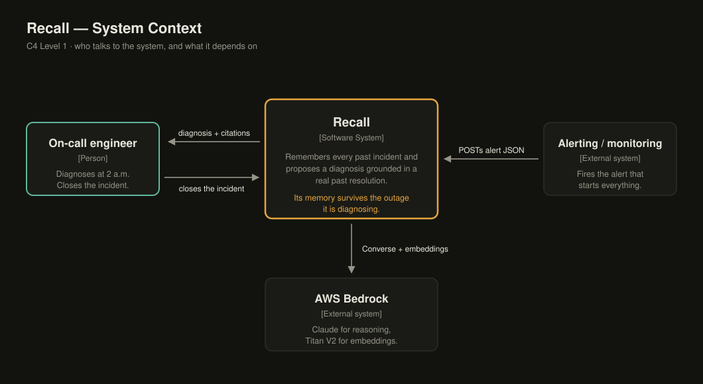
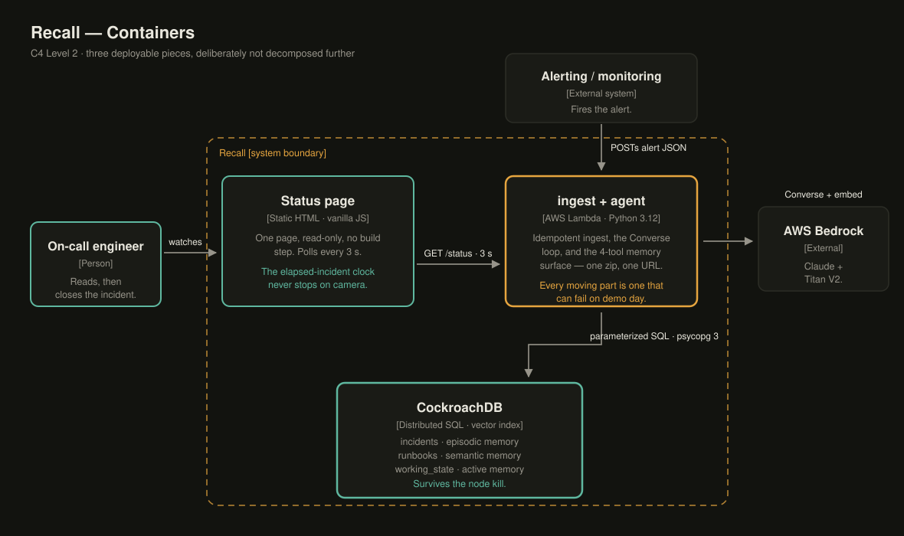
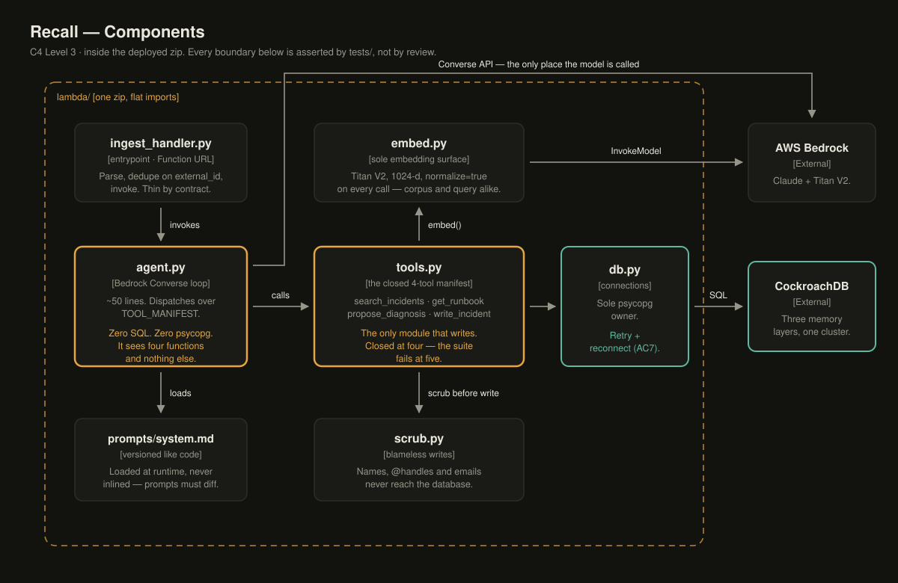

<div align="center">

# Recall

### An on-call agent that remembers every incident your team ever had — <br/>and whose memory survives the very outages it's diagnosing.

[](https://github.com/santapong/ReCall/actions/workflows/ci.yml)
[](pyproject.toml)
[](https://docs.astral.sh/uv/)
[](https://docs.astral.sh/ruff/)
[](LICENSE)
[](docs/08-final-sprint.md)

**CockroachDB × AWS hackathon entry** · built solo, in the open · submission target **Aug 17, 2026**

[The problem](#the-problem) ·
[Who it's for](#who-its-for) ·
[How it works](#how-it-works) ·
[Architecture](#architecture) ·
[Memory design](#memory-design--three-layers) ·
[Why CockroachDB](#why-cockroachdb) ·
[Quickstart](#quickstart) ·
[Roadmap](#roadmap)

</div>

---

> **Status — Aug 4.** All application code is built and tested: the 4-tool memory surface
> (read *and* write sides), the Bedrock Converse loop, ingest + status endpoints, the status page,
> the seed loader, the AC2 eval harness, and a rehearsed 3-node kill rig. What has not yet happened
> is the first *live* run — cloud credentials (CockroachDB Cloud + Bedrock) are the remaining
> gate. 50 tests green, DB-backed ones running against a real local CockroachDB.
> Changes are logged in [`CHANGELOG.md`](CHANGELOG.md).

## The problem

Tribal on-call knowledge lives in senior engineers' heads and rots in unread postmortems. When they
leave, it evaporates — and the next 2 a.m. incident gets diagnosed from zero, again. The knowledge
isn't missing; it's unreachable at the moment it matters.

The pain, concretely:

- **The same incident gets solved twice.** A failure that took four hours to root-cause last
  quarter takes four hours again, because the fix lives in a postmortem nobody opens at 2 a.m.
- **Diagnosis speed depends on who answers the page.** The engineer with eight years of context
  resolves in minutes; the new hire escalates. Mean time to resolution is really mean time to the
  right memory.
- **Postmortems are write-only.** Teams invest hours writing them; retrieval at incident time is
  grep-and-hope. The knowledge base grows while its usefulness doesn't.
- **Off-the-shelf AI assistants make it worse, confidently.** A model without incident memory
  produces generic advice — or worse, a plausible-sounding diagnosis with no grounding. On-call
  needs citations, not vibes.

**Recall makes institutional incident memory durable, queryable, and agent-native.** An alert comes
in; the agent retrieves the closest past incidents from a distributed vector index, proposes a
diagnosis grounded in the real resolution that worked last time — citing real incident IDs and a
real runbook step — and writes the fix back on close. Every resolved incident makes the next one
faster. And because that memory lives in CockroachDB, it survives the very outages it's helping
diagnose.

## Who it's for

- **On-call engineers** — the diagnosis reaches them seconds after the page, grounded in what
  actually fixed this failure before, with an honest confidence label instead of a confident guess.
- **SRE and platform teams** — institutional memory stops depending on who happens to still be on
  the team; the blameless scrubber keeps names out of the record by construction.
- **Engineering leaders** — postmortems become an asset with compounding returns rather than
  write-only documents, and `AS OF SYSTEM TIME` gives audits exactly what memory believed
  mid-incident.

## How it works

<p align="center"></p>

1. An alert POSTs to a Lambda Function URL; ingest is idempotent (same alert twice = same incident).
2. The agent embeds the alert and searches CockroachDB's **distributed vector index** for the closest
   past incidents at the fictional SaaS "Orbital" — scoped per service, decay-ranked so fresh
   incidents outrank stale ones.
3. It proposes a diagnosis **grounded in a real past resolution**, citing real incident IDs and a real
   runbook step — or, when nothing is close enough, says so plainly instead of guessing. An invented
   ID doesn't just violate the prompt; the write path rejects it before it can persist.
4. On close, the resolution is scrubbed of names and written back — so the *very next* similar alert
   retrieves it.

**Signature demo:** kill a database node mid-diagnosis, live on camera. The in-flight answer
completes; row counts stay identical; the incident clock never stops.

## Architecture

Documented as a [C4](https://c4model.com) set — hand-authored SVG in [`docs/diagrams/`](docs/diagrams),
no build step and no diagram toolchain to install. Each level zooms into the box the previous one drew.

### Containers — the three deployable pieces

<p align="center"></p>

One Lambda, one database, one static page. That's the whole system, and the sparseness is a decision:
every additional moving part is a part that can fail during a live demo. The status page polls the
Lambda's read-only `GET /status`; its `GET /health` row count is what's on camera during the node kill.

### Components — the boundaries the test suite enforces

<p align="center"></p>

The amber boxes are the invariants the pitch rests on, and none of them are honour-system: `agent.py`
importing psycopg, an `INSERT` outside `tools.py`, or a fifth tool in the manifest each fail
[`tests/test_module_boundaries.py`](tests/test_module_boundaries.py) and
[`tests/test_manifest.py`](tests/test_manifest.py) in CI.

There is deliberately no L4 code-level diagram — the code *is* the L4, and a diagram duplicating it
would rot the first time someone renamed a function.

## Memory design — three layers

| Layer | Table | What it holds | Written by |
|---|---|---|---|
| **Episodic** | `incidents` | Every incident ever, resolved or in-flight, with embeddings | ingest + close path |
| **Semantic** | `runbooks` | Distilled how-to knowledge, independent of any one incident | seed loader |
| **Working** | `working_state` | What the agent believes about the *active* incident — retrieved matches, proposed diagnosis, confidence | the agent loop |

Schema: [`infra/schema.sql`](infra/schema.sql). Retrieval is a service-scoped `<->` vector query with a
decay re-rank in Python (`score = (1 − norm_distance) · exp(−age_days / half_life)`), so the ranking
is tunable and unit-testable.

## The agent's contract

The tool manifest is **closed at exactly four tools** — memory read/write only, no raw SQL, no escape
hatches. This isn't a style choice; it's the security and honesty story, and a test fails if anyone
adds a fifth.

| Tool | Does | Guarantee |
|---|---|---|
| `search_incidents` | vector search + decay re-rank | returns an explicit confidence label: `high` / `low` / `none` |
| `get_runbook` | fetch one runbook by ID | read-only, no search |
| `propose_diagnosis` | record the diagnosis | writes *working memory only*; cited IDs are validated against the DB — an unknown ID raises, never persists |
| `write_incident` | close + write back the fix | blameless scrub first: names, @handles, emails never persist |

**Propose-only:** the agent never executes fixes. **Confidence honesty:** at `none` it says "no close
match in memory" and stops — zero invented incident IDs, enforced by tests. An uncited diagnosis is
only accepted on that honesty branch; anywhere else the write path refuses it.

## Why CockroachDB

| The demo needs | CockroachDB delivers |
|---|---|
| Memory that survives infrastructure failure | Distributed, replicated SQL — kill 1 of 3 nodes mid-diagnosis, zero committed rows lost (rig rehearsed: [`infra/chaos/`](infra/chaos/index.md)) |
| Semantic search over incidents | Native `VECTOR` type + distributed vector index (C-SPANN), scoped per service by a prefix column |
| "What did memory believe at 02:14?" | `AS OF SYSTEM TIME` time-travel reads |
| A boring, auditable data path | Postgres wire protocol — plain parameterized SQL via psycopg 3, no ORM |

## Tech stack

| Layer | Pick | Why |
|---|---|---|
| Agent | Claude on **AWS Bedrock** (Converse API), custom loop in [`lambda/agent.py`](lambda/agent.py) | full control of the 4-tool manifest; confidence branching stays visible; invented IDs bounce off the write path |
| Embeddings | Bedrock Titan V2, 1024-d, `normalize:true` always | same platform, same credential, no second vendor; unit vectors keep `<->` metric-safe |
| Ingest | **AWS Lambda** + Function URL (POST ingest, GET `/status` + `/health`) | one URL, zero gateway config, fewest moving parts on demo day |
| Database | **CockroachDB** + distributed vector index | see table above — it *is* the thesis |
| Frontend | one static HTML page, vanilla JS ([`status_page/`](status_page/index.md)) | the audience is a camera; build risk ≈ 0 |
| Tooling | Python 3.12 · uv · psycopg 3 · pydantic · pytest · ruff | boring wins; every pick documented in [`docs/04`](docs/04-tech-stack.md) |

## Quickstart

```bash
git clone https://github.com/santapong/ReCall.git && cd ReCall
uv sync                      # deps — uv provisions Python 3.12 itself
uv run pytest                # fast suite; DB-backed tests skip without a cluster
make help                    # every workflow: probe, migrate, seed, chaos-up, deploy…
```

With any CockroachDB — Cloud free tier or a local single-node
(`cockroach start-single-node --insecure`) — set `CRDB_CONN_STRING`
(`cp .env.example .env`), then:

```bash
make probe                   # DDL + 5 rows + one `<->` vector query, then cleans up
make migrate                 # apply infra/migrations/*.sql in order
uv run pytest                # now 50/50 — the DB-backed tests run for real
```

The AC7 resilience rig (needs Docker):

```bash
make chaos-up                # 3-node local cluster, vector index flag enabled
docker stop recall-crdb-2    # the kill — survivors keep serving
make chaos-down              # stop and wipe
```

## Roadmap

Gate-exited phases. The 13 acceptance criteria live in
[`docs/01-objective-roadmap.md`](docs/01-objective-roadmap.md); the live calendar is
[`docs/08-final-sprint.md`](docs/08-final-sprint.md); the video script is
[`docs/09-demo-script.md`](docs/09-demo-script.md).

| Phase | Window | Exit criterion | |
|---|---|---|---|
| **P0 · Probe** | Aug 2–4 | live cluster + vector query + Bedrock access requested | 🟡 local probe passed (flag-then-works); Cloud half awaits credentials |
| **P1 · Memory foundation** | Aug 3–7 | planted incident retrieved top-3 from CLI; 80-postmortem corpus | 🟡 code + loader + eval harness done; embedding pass awaits Bedrock |
| **P2 · Agent loop** | Aug 8–12 | `curl` an alert → diagnosis citing a real incident + runbook | 🟡 loop, prompt, handler built + offline-tested; first live run awaits credentials |
| **P3 · Surface** | Aug 13–14 | live status page; demo script ≤3 min | 🟡 page + script v1 built; goes live with the Lambda |
| **P4 · Resilience** | Aug 15–16 | node-kill rehearsal recorded, zero row loss verified | 🟡 rig built, kill rehearsed mechanically; recorded take remains |
| **P5 · Ship** | Aug 17–18 | video ≤3:00 up; Devpost submission confirmed | ⚪ |

**After the hackathon** — deliberately parked until submission ([`docs/01`](docs/01-objective-roadmap.md)
scope discipline): nightly memory consolidation (episodic → semantic), live Slack ingest,
region-level chaos, Agent Skills diagnostics. The parked list is the feature backlog, not a graveyard.

## Development

The repo is built to be driven by both a human and coding agents — conventions are executable where
possible.

- **Branching** ([`docs/07`](docs/07-branching-worktrees.md)): `feat/* → develop → release/* → main`,
  where `main` is release-only and every merge into it is tagged (`w1`…`w6`, the runnable-increment
  KPI). Short-lived branches are named for intent — `feat/` `fix/` `test/` `docs/` `chore/`
  `experiment/` `hotfix/` — so the history reads honestly. Parallel work happens in **git worktrees**
  (`scripts/wt.sh new feat/<slug>`), one branch = one folder = one venv.
- **Enforced boundaries**: `agent.py` contains zero SQL; `tools.py` is the only module that writes;
  the 4-tool manifest is exactly 4 — all asserted by [`tests/`](tests/index.md), not by review vibes.
- **Testing**: pytest is ground truth. The retrieval eval is a reproducible 20-alert benchmark with
  pinned expected IDs — ≥18/20 top-3 or the gate doesn't exit. DB tests run against a real
  single-node CockroachDB; mocked-DB tests are banned.
- **Docs**: [`CLAUDE.md`](CLAUDE.md) is the agent-facing index with eight hard rules; every folder
  ships an `index.md`. Navigate by index — never bulk-load the repo to orient.
- **Commits** name the acceptance criterion they advance: `feat(tools): decay re-rank [AC2]`.

## License

[MIT](LICENSE) © 2026 [Santapong Sondhi](https://github.com/santapong)

<div align="center"><sub>Built for the CockroachDB × AWS hackathon — an agentic-memory reference
implementation for on-call engineering.</sub></div>
