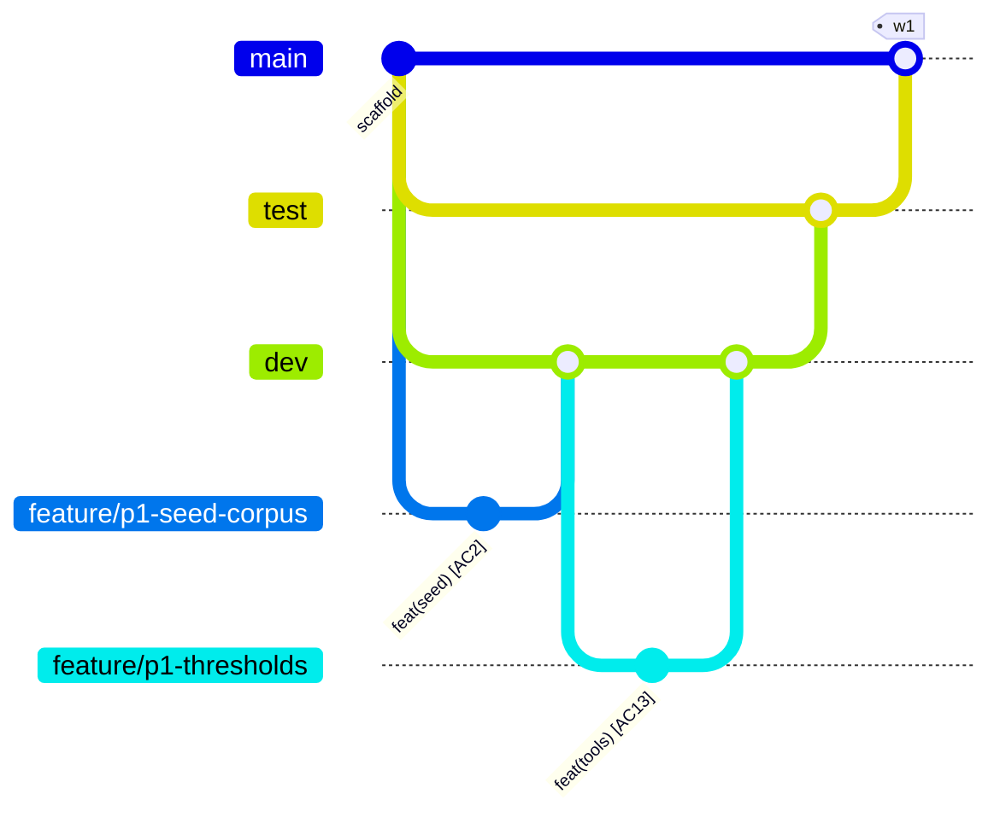

# 07 · Branching & Worktrees

*Added Jul 8 at repo setup. Governs every branch, merge, and checkout. Same clause as `05`: when this file and a habit disagree, this file wins; when reality proves it wrong, change it here in the same commit.*

## Why this shape

Solo build plus agent sessions means the real risks are not human merge conflicts. They are: (a) breaking the demo-ready line three days before a gate, and (b) two checkouts — human + remote Claude session, or two file-disjoint subagents (docs/06) — fighting over one working directory. Long-lived branches with promotion gates handle (a); worktrees handle (b). Everything else stays deliberately small: this is a ≤60 h project, not a release train.

## Branch roles

| Branch | Lives | Role | Checks |
|---|---|---|---|
| `main` | forever | Demo/submission-ready, always runnable. Weekly tags `w1`…`w6` land here (runnable-increment KPI). Never commit to it directly. | green CI required |
| `test` | forever | Promotion gate between `dev` and `main`. The expensive checks run here: DB-backed tests against a local single-node cockroach, the AC2 retrieval eval (P1+), chaos-rig rehearsal (P4). | full suite |
| `dev` | forever | Integration. Default base and merge target for all day-to-day work. | fast suite |
| `feature/<slug>` | days | New feature off `dev`, PR back into `dev`. PR title names the AC it advances. | fast suite on PR |
| `fix/<slug>` | hours | Bugfix off `dev`, PR into `dev`. | fast suite on PR |
| `spike/<slug>` | hours | Probes and experiments (e.g. P0 probe variations). Never merged — findings go to WORKLOG/docs, branch deleted. | none |
| `hotfix/<slug>` | hours | Demo-day emergency off `main`, PR into `main`, then merge `main` back down into `test` and `dev` immediately. | fast suite on PR |
| `claude/<slug>` | days | Branches created by remote Claude Code sessions. Treated exactly like `feature/*`: PR into `dev`. | fast suite on PR |

**Flow:** `feature/* → dev → test → main → tag wN`. Promotions (`dev→test`, `test→main`) are plain merges, made only when green, ideally right before each weekly tag. Phase gates in `docs/01` map onto tags: a gate exits when its tag exists on `main`.



## Naming & commits

- Slugs are kebab-case; prefix with the phase when it helps: `feature/p1-seed-corpus`, `spike/p0-mcp-headless`.
- Commit format is unchanged from `docs/05`: `feat(tools): decay re-rank in search_incidents [AC2]`. Merges to `dev` carry the AC tag in the PR title too.

## CI mapping

- **Fast suite** — `ruff check` + `pytest` (structural + unit, no DB). Runs on every PR and on pushes to `main`/`dev`/`test`. Wired now in `.github/workflows/ci.yml`.
- **Full suite** — fast suite + single-node cockroach service + the AC2 eval. Added to the `test` branch's pushes in P1, when the first DB-backed test exists. Mocked-DB tests stay banned (`docs/05`).
- Recommended GitHub settings (manual, one-time): protect `main` and `test` — require a PR and green checks; on `dev` require green checks only.

## Bootstrap — once, after the setup PR merges

```
make branches-init      # creates dev + test from origin/main and pushes them
```

Until `dev` exists, session branches (like the one that created this file) PR into `main`. After bootstrap, everything targets `dev`.

## Worktrees

One clone, many working directories: each branch checked out in its own folder, all sharing one object store. No stashing, no juggling half-done checkouts, and parallel sessions can't trample each other — docs/06's "file-disjoint parallel units" becomes *directory-disjoint* here.

Layout — siblings outside the repo, so nothing inside the repo ever scans them:

```
~/Roll                                  # main checkout — keep it on dev for daily work
~/Roll.worktrees/test                   # long-lived: promotion checks run here
~/Roll.worktrees/feature-p1-seed-corpus # one per in-flight branch, deleted on merge
```

Helper — `scripts/wt.sh` (wraps `git worktree`; slashes in branch names become dashes in folder names):

```
scripts/wt.sh new feature/p1-seed-corpus   # new branch off dev (default base) + worktree
scripts/wt.sh new spike/p0-probe main      # explicit base
scripts/wt.sh add test                     # worktree for an existing branch
scripts/wt.sh ls                           # list worktrees
scripts/wt.sh rm feature/p1-seed-corpus    # remove the worktree (branch survives)
scripts/wt.sh prune                        # clean up stale registrations
```

Rules:

1. One branch = one worktree (git enforces this). The main checkout stays parked on `dev`.
2. Each worktree gets its own venv — run `uv sync` inside it before first use. `.env` is not copied automatically; copy it in only if the task needs the DB.
3. When the PR merges: `wt.sh rm <branch>`, then `git branch -d <branch>`.
4. Weekly tags are cut from the main checkout on `main`, never from a worktree.
5. Subagent sessions that write files get their own worktree each; two workers in one directory is the docs/06 rule broken with extra steps.

## Lifecycle cheatsheet

```
scripts/wt.sh new feature/p1-seed-corpus
cd ../Roll.worktrees/feature-p1-seed-corpus && uv sync
# ...work, commit with [ACn], then:
git push -u origin feature/p1-seed-corpus   # PR → dev
cd ~/Roll && scripts/wt.sh rm feature/p1-seed-corpus && git branch -d feature/p1-seed-corpus
```
