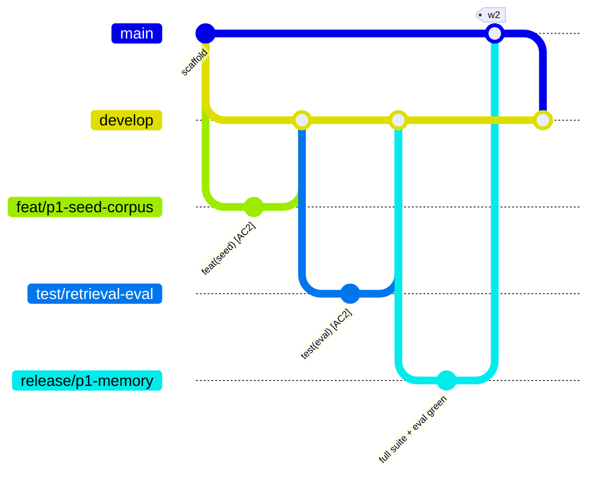

# 07 · Branching & Worktrees

*Added Jul 8 at repo setup; branch model rewritten 2026-08-02 — see "What changed and why" at the bottom. Governs every branch, merge, and checkout. Same clause as `05`: when this file and a habit disagree, this file wins; when reality proves it wrong, change it here in the same commit.*

## Why this shape

Solo build plus agent sessions means the real risks are not human merge conflicts. They are: (a) breaking the demo-ready line three days before a gate, and (b) two checkouts — human + remote Claude session, or two file-disjoint subagents (docs/06) — fighting over one working directory. Long-lived branches with promotion gates handle (a); worktrees handle (b). Everything else stays deliberately small: this is a ≤60 h project, not a release train.

## Branch roles

Two branches live forever. Everything else is disposable and named for its intent.

| Branch | Lives | Role | Checks |
|---|---|---|---|
| `main` | forever | **Release only.** Every commit is a state you would submit. Arrives exclusively by merge from `release/*` or `hotfix/*`, and every merge is tagged. Never commit to it directly. | green CI required |
| `develop` | forever | **Prepare-to-release.** The integration line and the default base for all day-to-day work. Always green and installable, but not yet claimed as submittable. | fast suite |
| `release/<name>` | days | Release candidate cut from `develop`. Where the expensive checks run: DB-backed tests against a local cockroach, the AC2 retrieval eval, the chaos rehearsal. Stabilisation commits only — no new features. Merges into `main` (tagged), then back into `develop`. | **full suite** |
| `feat/<slug>` | days | New capability. Off `develop`, PR back into `develop`. PR title names the AC it advances. | fast suite on PR |
| `fix/<slug>` | hours | Bugfix. Off `develop`, PR into `develop`. | fast suite on PR |
| `test/<slug>` | hours | Test-only work: eval harnesses, fixtures, CI rigs, the chaos compose file. No production code. | fast suite on PR |
| `docs/<slug>` | hours | Documentation, diagrams, changelog. No code. | fast suite on PR |
| `chore/<slug>` | hours | Tooling, dependencies, CI config, repo governance. | fast suite on PR |
| `experiment/<slug>` | hours | Probes and spikes (e.g. P0 probe variations). **Never merged** — findings go to WORKLOG/docs, branch deleted. | none |
| `hotfix/<slug>` | hours | Demo-day emergency off `main`, PR into `main` (tagged), then merge `main` back into `develop` immediately. | fast suite on PR |
| `claude/<slug>` | days | Branches created by remote Claude Code sessions. Treated exactly like `feat/*`: PR into `develop`. | fast suite on PR |

**Flow:** `feat/* → develop → release/* → main (tagged) → back-merge into develop`

Weekly runnable-increment tags (`w1`…`w6`, the KPI in `docs/01`) and phase-gate tags both land on `main`. A gate exits when its tag exists there — a tag is a claim that the gate passed, so never tag ahead of the evidence.



## Why `release/*` and not a permanent staging branch

The previous model had a third permanent branch, `test`, sitting between `dev` and `main` as the promotion gate. It is gone, for two reasons:

1. **Git forbids the combination.** Refs are paths: `refs/heads/test` is a file, so `refs/heads/test/eval-harness` cannot be created beside it — git fails with *"cannot lock ref 'refs/heads/test/…': 'refs/heads/test' exists"*. A `test` branch and a `test/*` prefix are mutually exclusive. Verified against a scratch repo, not assumed.
2. **A permanent gate branch holds no state worth keeping.** Its entire job is "hold a candidate while the expensive checks run" — a job with a beginning and an end. `release/*` does identical work, is named for what it is stabilising, and disappears on merge, so the gate cannot silently drift behind `develop`. That drift is the classic failure of long-lived staging branches.

Nothing is lost: the full suite, the AC2 eval and the chaos rehearsal are the same checks in the same position in the flow.

## Naming & commits

- Slugs are kebab-case; prefix with the phase when it helps: `feat/p1-seed-corpus`, `experiment/p0-mcp-headless`.
- `release/*` is named for what it ships, not a semantic version: `release/p1-memory`, `release/submission`.
- Commit format is unchanged from `docs/05`: `feat(tools): decay re-rank in search_incidents [AC2]`. Merges into `develop` carry the AC tag in the PR title too.
- Picking a prefix is a one-question test: *what would a reader of the history call this change?* Production behaviour → `feat`/`fix`. Only tests → `test`. Only prose or diagrams → `docs`. Only tooling → `chore`. Throwaway learning → `experiment`.

## CI mapping

- **Fast suite** — `ruff check` + `pytest` (structural + unit, no DB). Runs on every PR and on pushes to `main` / `develop` / `release/**`. Wired in `.github/workflows/ci.yml`.
- **Full suite** — fast suite + a real single-node cockroach (v25.2.2, same as the rigs, vector-index flag set) + every DB-backed test. Wired 2026-08-04 (`.github/workflows/ci.yml`, `full` job): runs on pushes to `develop` and `release/**`. The AC2 eval joins it once the corpus is embedded (it needs Bedrock and skips with the reason until then). Mocked-DB tests stay banned (`docs/05`).
- Recommended GitHub settings (manual, one-time): protect `main` — require a PR and green checks; on `develop` require green checks only. Set `develop` as the default base for new PRs.

## Bootstrap — once

```
make branches-init      # creates develop from origin/main and pushes it
```

## Worktrees

One clone, many working directories: each branch checked out in its own folder, all sharing one object store. No stashing, no juggling half-done checkouts, and parallel sessions can't trample each other — docs/06's "file-disjoint parallel units" becomes *directory-disjoint* here.

Layout — siblings outside the repo, so nothing inside the repo ever scans them:

```
project/devops/
├── ReCall/                                # primary checkout — park it on develop
└── ReCall.worktrees/
    ├── feat-p2-agent-loop/                # one per in-flight branch, deleted on merge
    └── experiment-p0-mcp-headless/
```

Helper — `scripts/wt.sh` (wraps `git worktree`; slashes in branch names become dashes in folder names):

```
scripts/wt.sh new feat/p1-seed-corpus      # new branch off develop (default base) + worktree
scripts/wt.sh new experiment/p0-probe main # explicit base
scripts/wt.sh add develop                  # worktree for an existing branch
scripts/wt.sh ls                           # list worktrees
scripts/wt.sh rm feat/p1-seed-corpus       # remove the worktree (branch survives)
scripts/wt.sh prune                        # clean up stale registrations
```

Rules:

1. One branch = one worktree (git enforces this). The primary checkout stays parked on `develop`.
2. Each worktree gets its own venv — run `uv sync` inside it before first use. `.env` is never copied automatically; copy it in only when the task needs the DB. Fewer copies of a secret is strictly better.
3. When the PR merges: `wt.sh rm <branch>`, then `git branch -d <branch>`.
4. Tags are cut from the primary checkout on `main`, never from a worktree.
5. Subagent sessions that write files get their own worktree each; two workers in one directory is the docs/06 rule broken with extra steps.

## Lifecycle cheatsheet

```
scripts/wt.sh new feat/p1-seed-corpus
cd ../ReCall.worktrees/feat-p1-seed-corpus && uv sync
# ...work, commit with [ACn], then:
git push -u origin feat/p1-seed-corpus     # PR → develop
cd ../../ReCall && scripts/wt.sh rm feat/p1-seed-corpus && git branch -d feat/p1-seed-corpus
```

Cutting a release:

```
git switch develop && git pull
git switch -c release/p1-memory            # full suite + AC2 eval + chaos rehearsal run here
# ...stabilise only; no new features
git switch main && git merge release/p1-memory && git tag -a w2 -m "..." && git push origin main --tags
git switch develop && git merge main       # back-merge, always
git branch -d release/p1-memory
```

## What changed and why (2026-08-02)

Restructured at the `w1` freeze, before the P0 probe, so no in-flight work needed rebasing:

| Before | After | Reason |
|---|---|---|
| `dev` | `develop` | Says what it is without abbreviating; matches "prepare to release". |
| `test` (permanent) | `release/<name>` | Frees the `test/*` prefix (git ref collision, above) and makes the gate temporary, so it cannot drift. |
| `feature/*` | `feat/*` | Matches the commit-type vocabulary already in use (`feat(tools): …`). |
| `spike/*` | `experiment/*` | Plain English; "spike" is jargon that needs a footnote. |
| — | `test/*`, `docs/*`, `chore/*` | Non-production work stops being mislabelled as a feature, so the history reads honestly. |
